## Background

Years ago, I started my development journey learning javascript, NodeJS and React. My first project was, like others, building a  Pokedex App using the [PokeAPI](https://pokeapi.co/). The architecture was pretty simple:

1. The UI ran with vanilla javascript and React 15
2. The backend was a REST API build with NodeJS and Express
3. The database was a flat json file that was basically the same schema as the PokeAPI contract
4. The database was populated by a batch job that fetched the first generation of pokemon

```mermaid
flowchart TD

    UI["React Pokedex UI"]
    API["Node.js Pokemon API"]
    DB["JSON Pokemon Database"]
    BATCH["Batch Job (Fetches Gen 1 Pokémon)"]

    UI --> API
    API --> DB
    BATCH --> DB
```

Since then, there have been many new frameworks and enhancements made in the javascript community that would put my code then to shame. So, in honor of it being nearly 10 years since I did this humble project, I've decided to recreate this nostalgic Pokedex app!

## Application Design

### Frontend

For the UI, I'll continue to use React but this time leverage the [NextJS](https://nextjs.org/) framework. 

### Backend

While NextJS supports running it's own server, I'll choose to create a dedicated REST API with NodeJS but this time leverage [Fastify](https://fastify.dev/)

### Database

For my database, I'll trade in a flat JSON file in favor of first-class datastore in [Postgres](https://www.postgresql.org/) which supports storing JSON in tables

### Eventing

Finally to hydrate the database, I will leverage the [BullMQ](https://bullmq.io/) framework to create a lightweight job orchestration process to ingest pokemon data from the PokeAPI

### Infrastructure

Finally, to help keep my app portable, I will containerize these components using docker and leverage docker compose to orchestrate the communication between the apps

:construction: Stay tuned here for project updates! 
